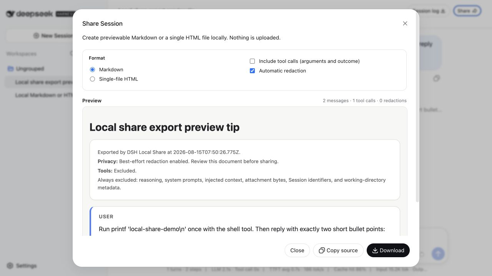

# DSH Local Share

[](https://github.com/ChuanTianML/dsh-local-share/actions/workflows/ci.yml)
[](LICENSE)

面向 [DeepSeek Harness](https://github.com/deepseek-ai/deepseek-harness) Session
的本地、隐私优先 Markdown 与单文件 HTML 分享插件。
DSH Local Share 是一个独立的社区插件。

[English](README.md)



无需上传对话，即可把完整 DSH Session 变成便于审阅的文档。DSH Local Share
会在 Web Session Header 中加入 **分享** 入口，先在本机生成预览，再允许复制源码
或下载文件。

- 支持 Markdown 或一个无脚本、自包含的 HTML 文件
- 每次打开弹窗都默认开启尽力而为的自动脱敏
- 复制或下载前先预览
- 工具名、有界参数和结果状态需要用户主动开启
- 工具结果正文与模型推理始终不导出
- 不依赖云服务、账号或公开链接后端，也不发起外部网络请求
- 不增加模型可见内容和模型 token 消耗

## 快速开始

DSH 目前仍处于开发者预览阶段。把精确 release 安装到 Web profile，然后启动
DSH：

```sh
dsh plugin --profile web add github:ChuanTianML/dsh-local-share#v0.2.0
dsh --profile web
```

打开一个非空 Session，点击 Header 中的 **分享**。安全默认值是 Markdown、排除
工具调用、开启自动脱敏。

卸载插件：

```sh
dsh plugin --profile web remove dsh-local-share
```

### 从 DSH Share 0.1.0 升级

0.2.0 使用独立的 package 和插件 ID，避免与社区中另一款名为 `dsh-share` 的插件
冲突：

```sh
dsh plugin --profile web remove dsh-share
dsh plugin --profile web add github:ChuanTianML/dsh-local-share#v0.2.0
```

## 查看隐私保护流程

弹窗从安全状态开始。关闭脱敏后，复制和下载会保持锁定，直到用户进行一次新的
风险确认；再次打开弹窗时会恢复安全默认值。


演示来自真实 Web 应用和隔离的 DSH profile，示例 Session 仅包含无敏感信息的
演示文本。

## 让 Coding Agent 安装

可以。安装、配置和验收只需要可审计的 CLI 命令与一个 YAML profile patch。把
下面的请求交给能够访问 DSH 所在机器终端的 Coding Agent：

```text
请把 DSH Local Share v0.2.0 安装到我的 DeepSeek Harness Web profile。

1. 先检测当前 DSH_HOME 和 dsh 版本，不要修改其他 profile。
2. 安装前检查仓库 package.json 中的生命周期脚本。
3. 将 github:ChuanTianML/dsh-local-share#v0.2.0 安装到 web profile。
4. 保留 profiles/web/cordis.patch.yml 中无关的条目。为 dsh-local-share 写入
   maxEvents 20000、maxOutputChars 2000000、maxToolArgumentChars 12000。
5. 运行 dsh --profile web --dump-config，证明三个值已经进入最终配置。
6. 启动 Web profile，打开一个非空 Session，确认“分享”弹窗默认选择 Markdown、
   排除工具调用并开启自动脱敏。
7. 报告运行过的每条命令和修改过的文件。未经我确认，不得上传导出的 Session，
   也不得关闭自动脱敏。
```

如果验收不能影响现有环境，让 Agent 在步骤 1–6 中使用一个全新的临时
`DSH_HOME`。

## Host 配置

默认值适合普通 Session。如果希望配置显式且便于审计，请把完整 config 对象加入
`$DSH_HOME/profiles/web/cordis.patch.yml`；未设置 `DSH_HOME` 时通常是
`~/.dsh/profiles/web/cordis.patch.yml`：

```yaml
- id: dsh-local-share
  config:
    maxEvents: 20000
    maxOutputChars: 2000000
    maxToolArgumentChars: 12000
```

Harness profile patch 会替换目标条目的整个 `config`，不会对字段进行深度合并，
因此一次写全三个上限最清晰。无需启动 Web server 即可检查最终组合：

```sh
dsh --profile web --dump-config
```

| 字段 | 默认值 | 含义 |
| --- | ---: | --- |
| `maxEvents` | `20000` | 一个 Session 可接受的最大原始事件数 |
| `maxOutputChars` | `2000000` | 文件或预览的最大字符数 |
| `maxToolArgumentChars` | `12000` | 每个已启用工具调用保留的最大参数字符数 |

Session 或总输出超限会明确失败。只有工具参数允许截断，预览会显示对应警告；无效
配置会在插件加载时失败。

## 隐私行为

默认文档只按日志顺序保留人类直接输入和助手可见文本。

| 内容 | 默认行为 | 可选行为 |
| --- | --- | --- |
| 人类输入 | 包含 | — |
| 助手可见文本 | 包含 | — |
| 工具名、有界参数、结果状态 | 排除 | 开启“包含工具调用” |
| 工具结果正文 | 排除 | 始终不包含 |
| 推理 / thinking | 排除 | 始终不包含 |
| 系统提示与请求配置 | 排除 | 始终不包含 |
| 插件注入的 user-role 上下文 | 排除 | 始终不包含 |
| 附件字节与 Session 元数据 | 排除 | 始终不包含 |

自动脱敏覆盖常见凭据、Authorization Header、含密钥的环境变量赋值、邮箱和本机
绝对路径。它是启发式保护，不是安全证明；分享前仍应检查预览。关闭自动脱敏后，
复制和下载会保持锁定，直到重新勾选风险确认。

预览运行在受 sandbox 限制的 `srcdoc` iframe 中。生成的 HTML 不含脚本和外部资源，
并带有严格的 Content Security Policy。

## 与 Session log ZIP 的区别

官方 Session log 导出的无损 ZIP 适合诊断和迁移；DSH Local Share 生成更小、可
直接阅读的文档，适合代码评审、Issue 报告、交接和知识分享。它会主动排除回放或
取证流程所需的信息。

## 开发

已验证的 Harness revision 是
`47f943859bef60e4160492346772ded9b24f765a`。请把开发 checkout 隔离到
`.sandbox/harness`：

```sh
corepack enable
pnpm install
git clone https://github.com/deepseek-ai/deepseek-harness.git .sandbox/harness
git -C .sandbox/harness checkout 47f943859bef60e4160492346772ded9b24f765a
pnpm --dir .sandbox/harness install --frozen-lockfile
pnpm --dir .sandbox/harness run build
pnpm run check
```

也可以用 `DSH_HARNESS_ROOT=/absolute/path/to/deepseek-harness` 指向另一个只读开发
checkout。`pnpm run check` 会运行严格类型检查、ESLint、单元与组合测试、Host/
浏览器构建、覆盖率以及 package dry run。profile 安装不会执行构建，因此仓库会
提交 `lib/` 产物。

完整产品与安全设计见 [docs/design.md](docs/design.md)。

## 兼容性

0.2.0 面向上述 DSH 开发者预览 revision。DSH 尚未承诺稳定的外部插件兼容性；
Harness 后续变化可能需要发布新的 DSH Local Share 版本。

## 安全报告

见 [SECURITY.md](SECURITY.md)。不要在公开 Issue 中粘贴真实凭据或私有 Session。

## License

MIT
